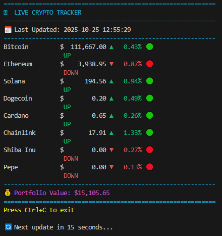
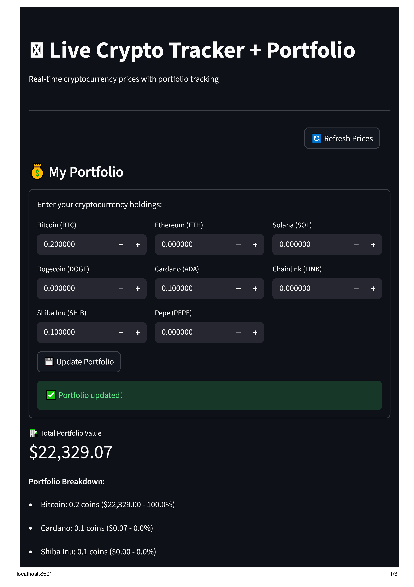
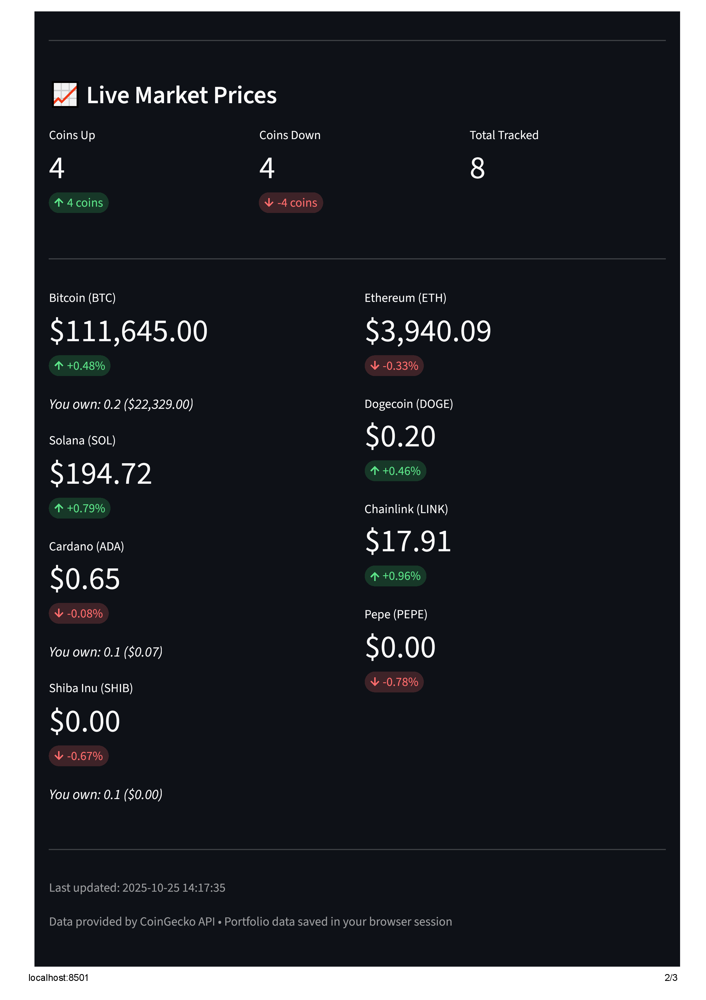

# 🪙 Real-time Crypto Tracker

A professional cryptocurrency price tracker with live market data, portfolio valuation, and beautiful terminal + web interfaces.

## ✨ Features
- **Real-time price updates** from CoinGecko API
- **Color-coded market movements** (green/red indicators)
- **Portfolio value calculator** - Track your investments
- **Auto-refresh every 15 seconds** - Always current data
- **Dual interfaces**: Terminal + Web versions
- **Market analytics** - Coins up/down summary

## 🎯 Live Demo

## 🎯 Live Demos

### Terminal Version


### Web Version  

### Portfolio Page


### Market Prices Page  


*Professional terminal interface with real-time crypto prices*

## 🚀 Quick Start

### Terminal Version
```bash
# Clone the repository
git clone https://github.com/YOUR_USERNAME/crypto-ticker.git
cd crypto-ticker

# Install dependencies
pip install -r requirements.txt

# Run the terminal application
python crypto_ticker.py
